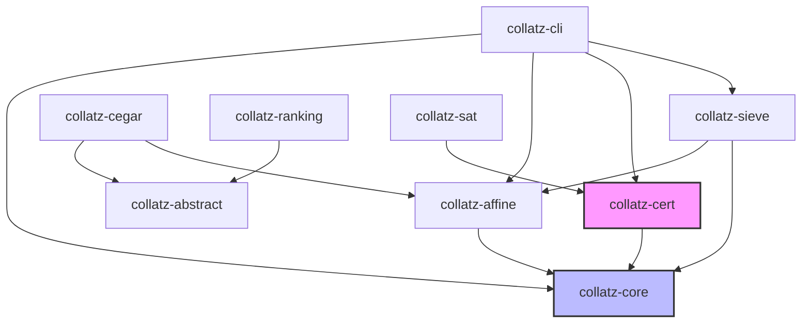

# Software Architecture & Cargo Workspace Layout

## 1. Progressive Core Workspace Strategy

To maintain high development velocity and prevent complex dependency bottlenecks early in the project, the Cargo workspace is organized into a **Progressive Core Architecture**. Development begins with a minimal 4-crate core before expanding into advanced solvers and synthesis crates.

```text
===================================================================
PHASE 1: MINIMAL CORE (Scaffolded Immediately)
===================================================================
collatz-lab/
├── Cargo.toml
├── docs/
└── crates/
    ├── collatz-core/          # Arithmetic maps, u128/BigUint steps
    ├── collatz-affine/        # Affine prefixes, modular inversion
    ├── collatz-cert/          # JSON certificate schemas & verifier
    └── collatz-cli/           # Command-line interface binary

===================================================================
PHASE 2: ADVANCED SOLVERS & SYNTHESIS (Scaffolded as needed)
===================================================================
    ├── collatz-sieve/         # Sieve traits, Roaring Bitmaps, beam search
    ├── collatz-abstract/      # Relational abstract domains & graph SCCs
    ├── collatz-cegar/         # Refinement loop & Craig interpolation
    ├── collatz-ranking/       # Linear difference constraints & Lyapunov functions
    ├── collatz-sat/           # SAT bit-blasting & LRAT proof logging
    ├── collatz-sygus/         # Syntax-guided synthesis interface
    ├── collatz-automata/      # Binary transducers & residue regular languages
    ├── collatz-diophantine/   # Simons & de Weger Diophantine cycle bounds
    ├── collatz-egraph/        # Equality saturation for affine macrosteps
    └── collatz-report/        # Markdown & JSONL experiment summaries

```

---

## 2. Crate Dependencies & Boundaries



> **Strict Trust Boundary Isolation:** `collatz-cert` must **never** depend on search crates (`collatz-sieve`), solver crates (`z3`, SAT solvers), or floating-point scoring libraries. It must remain a lightweight, deterministic arithmetic verification engine.

---

## 3. Tiered Arithmetic Strategy

To balance extreme execution throughput with arbitrary-precision safety, arithmetic operations follow a 3-tier strategy:

```text
┌─────────────────────────────────────────────────────────┐
│ Tier 0: u128 Fast-Path                                  │
│ - Zero allocation                                       │
│ - Used for valuations up to A_k <= 128                  │
│ - Promotes automatically to BigUint on overflow risk    │
└───────────────────────────┬─────────────────────────────┘
                            │ Overflow Guard
                            ▼
┌─────────────────────────────────────────────────────────┐
│ Tier 1: num-bigint (Default Pure-Rust Fallback)         │
│ - Pure Rust, zero C dependencies                        │
│ - Cross-platform (Windows, Linux, macOS, WASM)          │
│ - Guarantees 100% reproducible execution in CI/CD       │
└───────────────────────────┬─────────────────────────────┘
                            │ Optional Feature Flag [gmp]
                            ▼
┌─────────────────────────────────────────────────────────┐
│ Tier 2: rug / GMP (High-Performance Compute Backend)    │
│ - Binds to GNU MPFR / GMP C-libraries                   │
│ - Enabled via `cargo build --features gmp`              │
│ - Used for high-depth search nodes and large benchmarks │
└─────────────────────────────────────────────────────────┘
```

---

## 4. Core Rust Data Structures

### 4.1 Odd Step (`collatz-core`)
```rust
pub struct OddStep<N> {
    pub from: N,
    pub to: N,
    pub valuation: u32,
}
```

### 4.2 Affine Prefix (`collatz-affine`)
```rust
pub struct AffinePrefix {
    pub valuations: Vec<u32>,
    pub odd_steps: usize,
    pub total_twos: u64,
    pub constant: BigUint,
    pub starting_residue: BigUint,
    pub modulus_exponent: u64,
}
```

### 4.3 Search Node (`collatz-sieve`)
```rust
pub struct PrefixNode {
    pub prefix: AffinePrefix,
    pub growth_debt: f64,
    pub minimum_relative_height: f64,
    pub smallest_representative: BigUint,
    pub minimal_counterexample_feasible: bool,
    pub score: f64,
}
```

### 4.4 Affine Diagnostics (`collatz-affine`)
```rust
pub struct AffineDiagnostics {
    pub multiplicative_growth: f64,
    pub additive_remainder: BigUint,
    pub exact_relative_change: std::cmp::Ordering,
    pub paradoxical_prefix: bool,
}
```

### 4.5 Descent Certificate (`collatz-cert`)
```rust
pub struct DescentCertificate {
    pub schema_version: String,
    pub valuation_word: Vec<u32>,
    pub total_twos: u64,
    pub odd_steps: usize,
    pub starting_residue: String,   // String format prevents JSON float rounding
    pub modulus_exponent: u64,
    pub constant: String,           // String format prevents JSON float rounding
    pub descent_threshold: String,  // String format prevents JSON float rounding
    pub verified_exceptions: Vec<String>,
}
```

### 4.6 Core Interaction Calculus (`collatz-affine`)
```rust
pub struct PeriodicReturnCore {
    pub data: MacrostepData,
    pub fixed_point: OddRational2Adic,
}

pub struct CoreInteractionKernel<'a> {
    pub v: &'a PeriodicReturnCore,
    pub w: &'a PeriodicReturnCore,
    pub gamma: BigInt,
    pub kappa: TwoAdicValuation,
}
```

### 4.7 Projective Inverse System & Lift Blocks (`collatz-affine`)
```rust
pub struct PrecisionSchedule {
    pub levels: Vec<u64>,
}

pub struct ProjectiveResidue {
    pub precision: u64,
    pub least_representative: BigUint,
}

pub struct LiftBlock {
    pub from_precision: u64,
    pub to_precision: u64,
    pub value: BigUint,
}
```

---

## 5. Workspace Dependencies & Technology Selection

| Dependency | Version Role | Purpose |
| :--- | :--- | :--- |
| `num-bigint` | Pure Rust | Default arbitrary-precision integer backend |
| `num-traits` | Generic Traits | Generic numeric trait definitions (`Zero`, `One`) |
| `rug` | Optional (`feature = "gmp"`) | High-performance C/GMP integer backend |
| `rayon` | Concurrent Search | Data-parallel tree evaluation |
| `roaring` | Compressed Bitsets | Fast sparse residue set operations |
| `serde` / `serde_json` | Serialization | JSON certificate generation (strings for BigInts) |
| `clap` | CLI Parser | Command-line argument parsing (`derive` feature) |
| `petgraph` | Graph Engine | Abstract transition graphs and SCC analysis |
| `criterion` | Benchmarking | Micro-benchmarks for `odd_step` and affine composition |
| `proptest` | Property Testing | Randomized identity verification ($2^{A_k} n_k = 3^k n_0 + c_k$) |
| `tracing` | Structured Logging | Diagnostic event emission during searches |
